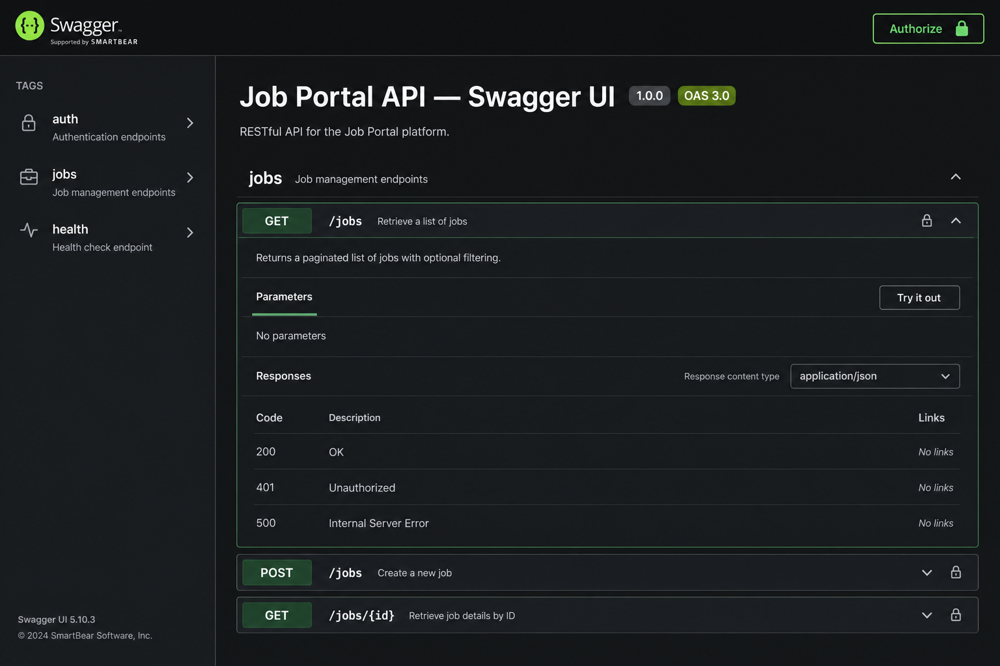

# Swagger UI and OpenAPI usage

The NestJS API serves **Swagger UI** at **`/api-docs`**. The checked-in machine-readable spec is **[`openapi.json`](../../openapi.json)** at the repository root (run **`npm run openapi:export`** after changing controllers or DTOs).

## Accessing Swagger UI

1. Configure environment variables required by the API (at minimum **`JWT_SECRET`** and **`JWT_REFRESH_SECRET`** for auth). For local development you can copy `.env.example` if present or set variables in your shell.

2. Start the server (default port **3000**):

   ```bash
   npm run start:dev
   ```

3. Open **`http://localhost:3000/api-docs`** in a browser.

You will see tags **`auth`**, **`jobs`**, and **`sample`**, plus schema components derived from DTOs (`RegisterDto`, `JobListingResponseDto`, …).



## Authenticating in Swagger UI (`JWT-auth`)

Access tokens are returned as **`accessToken`** (camelCase) from **`POST /auth/register`**, **`POST /auth/login`**, or refreshed via **`POST /auth/refresh`**.

1. Expand **`POST /auth/login`** (or register), click **Try it out**, submit valid credentials.
2. Copy **`accessToken`** from the JSON response (do not include the word `Bearer`).
3. Click **Authorize** in Swagger UI, paste into **`JWT-auth`**, and confirm.

Subsequent **Try it out** calls send `Authorization: Bearer <accessToken>`. Protected routes include employer **`POST/PATCH/DELETE /jobs`**, all **`/sample/**`** probes, and any future guarded endpoints. **`POST /auth/refresh`** accepts a **`refreshToken`** and returns a new token pair without needing bearer auth.

Role values in JWTs mirror [`Role`](../../src/common/enums/role.enum.ts): **`job_seeker`**, **`employer`**, **`admin`**.

## Example `curl` commands

Replace host, tokens, and ids as appropriate.

**Login**

```bash
curl -sS -X POST http://localhost:3000/auth/login \
  -H 'Content-Type: application/json' \
  -d '{"email":"you@example.com","password":"your-password"}'
```

**Refresh**

```bash
curl -sS -X POST http://localhost:3000/auth/refresh \
  -H 'Content-Type: application/json' \
  -d '{"refreshToken":"YOUR_REFRESH_TOKEN"}'
```

**List published jobs**

```bash
curl -sS 'http://localhost:3000/jobs?page=1&limit=10&location=Berlin'
```

**Create job (employer token)**

```bash
curl -sS -X POST http://localhost:3000/jobs \
  -H 'Content-Type: application/json' \
  -H "Authorization: Bearer YOUR_ACCESS_TOKEN" \
  -d '{"title":"Senior Backend Engineer","description":"Minimum twenty characters of description text here.","location":"Berlin, DE","salary":95000,"category":"full_time"}'
```

**Sample RBAC probe**

```bash
curl -sS http://localhost:3000/sample/admin-only \
  -H "Authorization: Bearer YOUR_ACCESS_TOKEN"
```

## Reading and validating the OpenAPI document

- **`tags`** group routes (`auth`, `jobs`, `sample`).
- **`components.schemas`** mirror DTO and response classes (`AuthSessionResponseDto`, `PaginatedJobsResponseDto`, …).
- **`components.securitySchemes`** defines bearer **`JWT-auth`** aligned with Passport JWT extraction.

Regenerate `openapi.json` (uses an in-memory SQLite configuration via **`NODE_ENV=test`** inside the export script):

```bash
npm run openapi:export
```

Lint with Spectral (install the CLI globally once):

```bash
npm i -g @stoplight/spectral-cli
npm run spectral:lint
```

Rules live in [`spectral.yaml`](../../spectral.yaml); the npm script delegates to [`scripts/run-spectral.sh`](../../scripts/run-spectral.sh).
